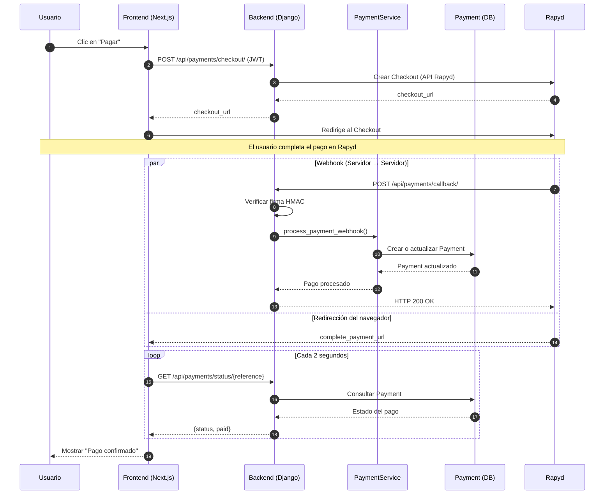

# App `payments`

Integración con la pasarela de pagos Rapyd (sandbox). Para instrucciones
de configuración local (ngrok, llaves de Rapyd, variables de entorno),
ver `technical_decisions.md`.

## Diagrama de flujo




## Endpoints

### `POST /api/payments/checkout/`

Inicia un checkout en Rapyd para el usuario autenticado.

- **Auth**: requiere JWT (`Authorization: Bearer <access_token>`)
- **Body**:
  ```json
  {
    "amount": "45000.00",
    "currency": "COP",
    "country": "CO",
    "reference": "opcional, se autogenera si se omite"
  }
  ```
- **201 Created**:
  ```json
  { "reference": "ORD-3F9A2B1C4D5E", "checkout_url": "https://sandboxcheckout.rapyd.net/..." }
  ```
- **400 Bad Request**: datos de entrada inválidos (ej. `amount <= 0`)
- **502 Bad Gateway**: Rapyd rechazó la petición — revisar
  `rapyd_error` en el body de la respuesta para el detalle exacto

El frontend debe redirigir al usuario a `checkout_url` tras recibir la
respuesta (`window.location.href = checkout_url`).

### `GET /api/payments/status/<reference>/`

Consulta el estado actual de un pago por su referencia. Pensado para
hacer *polling* desde la página de confirmación, ya que el navegador
puede volver a tu sitio antes de que el webhook haya llegado.

- **Auth**: requiere JWT
- **200 OK** (aún sin pago registrado):
  ```json
  { "reference": "ORD-3F9A2B1C4D5E", "status": "pending" }
  ```
- **200 OK** (pago ya procesado):
  ```json
  {
    "merchant_reference_id": "ORD-3F9A2B1C4D5E",
    "status": "CLO",
    "paid": true,
    "amount": "45000.00",
    "currency_code": "COP",
    "failure_message": "",
    "created_at": "2026-07-23T02:28:14.655566Z"
  }
  ```
- **403 Forbidden**: el pago pertenece a otro usuario (y quien
  consulta no es staff)

Valores posibles de `status`: ver `Payment.STATUS_CHOICES` en
`models.py` (`CLO` = completado, `ERR`/`CAN` = fallido, `PEN`/`INIT` =
en proceso).

### `POST /api/payments/callback/`

Webhook que recibe las notificaciones de Rapyd. **No es de uso
directo del frontend** — lo llama Rapyd exclusivamente.

- **Auth**: ninguna a nivel de permisos DRF (`AllowAny`), pero valida
  la firma HMAC de Rapyd en cada request; rechaza con `401` si no
  coincide.
- Actualiza (o crea) el `Payment` correspondiente vía
  `process_payment_webhook`.
- Es idempotente: reintentos del mismo evento por parte de Rapyd no
  duplican registros (`update_or_create` sobre `rapyd_payment_id`).

### `GET /payments/complete/` y `GET /payments/error/`

Endpoints placeholder de depuración en el backend (no forman parte
del flujo de usuario final — esa función ahora la cumple
`FRONTEND_URL/payments/confirmacion` en el frontend). Se mantienen
únicamente como fallback si `FRONTEND_URL` no está configurada.

## Comandos de verificación manual

```bash
# Crea un checkout de prueba end-to-end contra el sandbox real de Rapyd
docker exec -it smartsnack_backend python manage.py test_initiate_checkout

# Corre la suite de tests de esta app
docker exec -it smartsnack_backend python manage.py test apps.payments -v 2
```

## Decisiones de diseño

- **Desacoplado de `orders`**: `build_checkout_page` recibe primitivos
  (`reference`, `amount`, `currency`, `country`), no un modelo
  `Order`. Cuando esa app exista, `initiate_checkout` puede evolucionar
  para recibir un `order_id`, validar pertenencia, y calcular el monto
  desde ahí, sin tocar `services.py`.
- **Montos siempre como string** en el body enviado a Rapyd
  (`f"{amount:.2f}"`) — Rapyd normaliza los números al recalcular la
  firma del lado suyo, y una representación numérica ambigua
  (`45000.0` vs `45000`) invalida la firma sin dar un error claro.
- **`url_path` en la verificación de webhooks es la URL completa**
  (`request.build_absolute_uri()`), no solo el path — a diferencia de
  las requests salientes hacia Rapyd, donde sí es solo el path.
